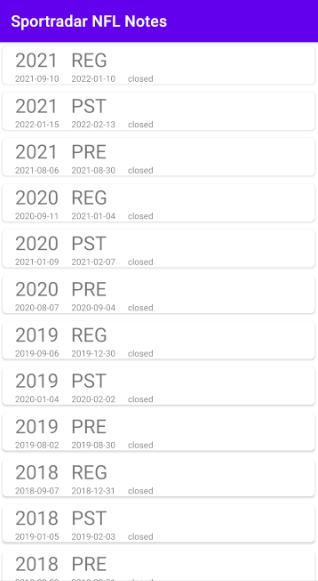
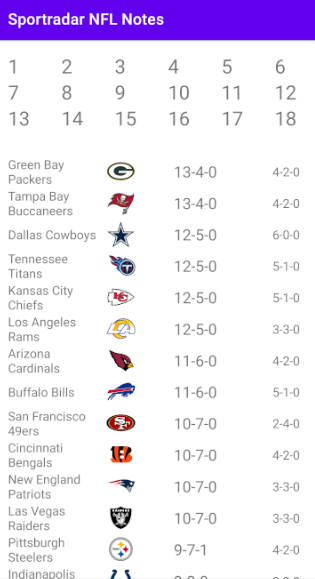
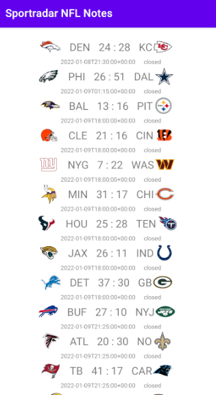

SportradarNFLNotes 

Функции:
- получать и хранить данные https://developer.sportradar.com/docs/read/american_football/NFL_v7
- отображать данные по сезонам и неделям
- отмечать игры просмотренными, выводить, хранить и обрабатывать результаты просмотренных игр
- считать и отображать положение команд в турнирной таблице

